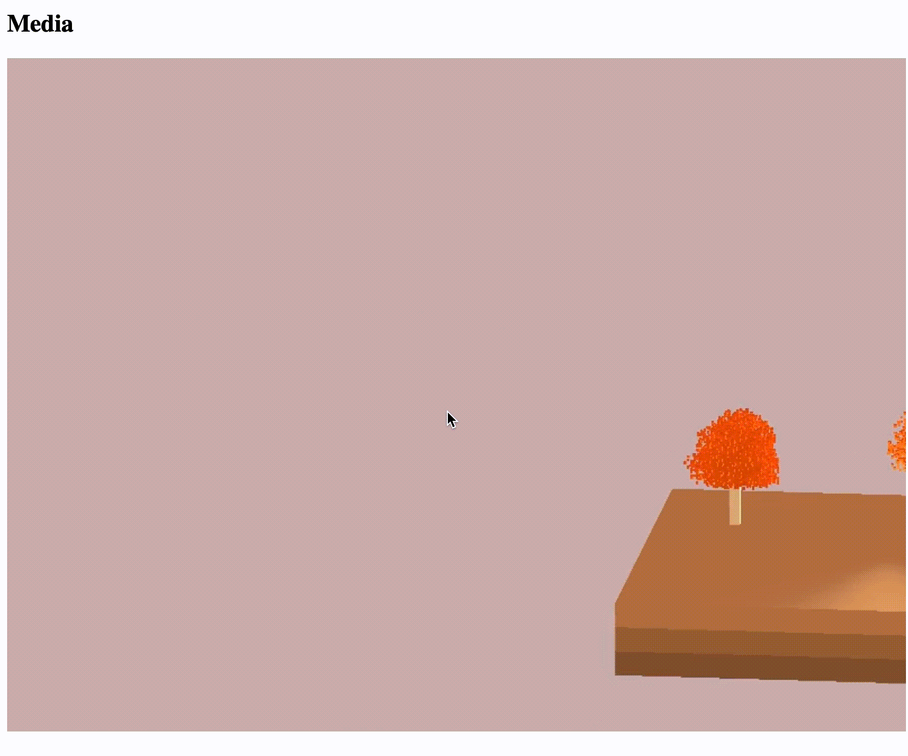

## Opengl-webrtc-streamer

The proj is based on cloud rendering.(云渲染)



### 1 Set Up 
For the detailed enviroment setup, please refer to [SETUP.md](./docs/setup.md).
Ubuntu and macos is recommended.
And please note that the server file is from libdatachannel repo.

```shell
git submodule update --init --recursive
cmake -B cmake-build-debug
cd cmake-build-debug
make
```
before running the program, please make sure the server is set up. 
```shell
cd client
python3 signaling-server.py
python3 -m http.server --bind 127.0.0.1 8080
```
then just run the program `./ors`, and open http://127.0.0.1:8080/ in your browser, and press start button.

### 2 Funcs

Lots of work still need to be done.

- [x] Record OpenGL app screen and encode to H.264
- [x] Rtmp Streamer, which can push the H.264 raw frame in buffer to server
- [x] Webrtc
- [x] Terminal controls transfer to server

### 3 Next Steps
- [x] Use librtc(libdatachannel is the origin name) to send memory video.
- [x] Enable browser control.
- [ ] Integrate with webgl rendering.
- [ ] Accelerate encode.

**Please note: the repo's license is MIT, but the 3rd_party/librtc is GPL.**

